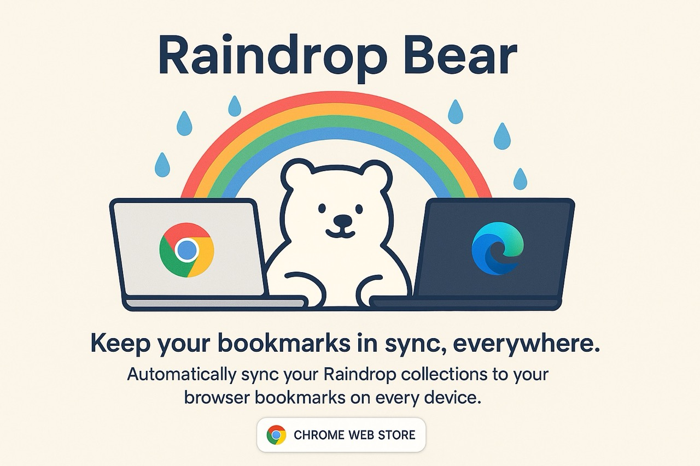

# 🐻‍❄️💦 Raindrop Bear

A tiny helper with one cuddly purpose: **sync your Raindrop.io collections and bookmarks into your browser’s bookmarks — across devices**. No fuss, no feature soup. Just your cloud bookmarks, happily living in your Bookmarks Bar. Rawr!

---

## 🚀 What’s New

- 🪟 **New toolbar popup:** One-click actions for Sync, Save to Unsorted, Save as Project (highlighted tabs), ⏫ Sync current window as project (live), and Recover/Delete projects
- 💾 **Projects:** Capture a set of tabs as a named project under a special Raindrop group "🐻‍❄️ Projects" and reopen later from the popup
- 🛡️ **Smarter sync:** Now one‑way mirroring (Raindrop → local). The "🐻‍❄️ Projects" group is excluded from local bookmarks mirroring (kept cloud‑only), reducing clutter
- ✨ **Options UI & notifications:** Clean setup flow and optional success/failure toast after sync
- 📂 **Choose parent folder:** Pick where the managed `Raindrop` folder lives (defaults to Bookmarks Bar)

---

## Get it

- **Chrome Web Store:** [Raindrop Bear](https://chromewebstore.google.com/detail/raindrop-bear/gkcgbmlbjcdmnifhcmfgkafekaohjcof)

---

## What it does

- **One‑way sync:** Mirrors Raindrop → your local browser bookmarks under the managed `Raindrop` folder (local edits aren’t mirrored back)
- Creates a `Raindrop` folder inside a parent folder you choose (defaults to Bookmarks Bar), mirroring your groups and collections
- Keeps things fresh automatically every \~10 minutes, or run a manual sync from the popup
- **Save to Unsorted:** From the popup, send the current/highlighted tabs to Raindrop’s Unsorted
- **Projects:** Save highlighted tabs as a project in Raindrop → later, recover it from the popup (restores grouping/order)
- **⏫ Sync current window as project (live):** Keep a Raindrop project synced with your current window’s tabs until you stop it
- **Optional notifications:** Cute toast after every sync
- **Modern Options UI:** Simple, clean setup

---

## Install (from source)

1. Download or clone this repo
2. Open `chrome://extensions` in Chrome/Brave/Edge (Chromium browsers, MV3)
3. Toggle on Developer mode
4. Click “Load unpacked” and select this project folder

---

## Setup (just once!)

1. Open the extension Options
2. Paste your Raindrop API token

   - Find/generate: `https://app.raindrop.io/settings/integrations`
   - Not sure how? see here: [How to Create Raindrop API Token](https://triiii.notion.site/How-to-Create-Raindrop-API-Token-2627aa7407c180619342c799d5377949)

3. Save — your bookmarks will start syncing into the `Raindrop` folder ✨

---

## How sync works

- Runs every \~10 minutes in the background
- Mirrors Raindrop groups → top-level folders; collections → subfolders
- Adds/updates bookmarks; removes ones you’ve trashed in Raindrop
- “Unsorted” items go into an `Unsorted` folder under `Raindrop`
- **One‑way:** Changes flow Raindrop → local only within the managed `Raindrop` folder
- **Excludes Projects:** Items under the Raindrop group `🐻‍❄️ Projects` stay in the cloud and are not mirrored locally
- Strictly edits the `Raindrop` folder—editing other local bookmarks won’t affect your cloud

---

## Permissions & privacy

- **bookmarks**: create/update folders and bookmarks for sync
- **storage** and **unlimitedStorage**: save lightweight sync state locally
- **notifications**: optional “sync done/failed” toasts
- **alarms**: schedule periodic syncs
- **tabs**: used by popup actions to save current/highlighted tabs, ⏫ sync the current window as a project, and recover Projects into windows
- **Host**: `https://api.raindrop.io/*` only

Privacy promise: your API token stays **local**. No analytics. No tracking. Just syncing. 💙

---

## Tips

- Click the toolbar icon to open the popup: Sync now, Save to Unsorted, Save as Project, ⏫ Sync current window as project, Recover/Delete a project
- If you delete the `Raindrop` folder, the next sync will safely recreate it
- Enable or disable sync notifications in Options

---

## License

MIT
**Changelog:**
See Releases on GitHub: https://github.com/riiiiiiiiiina0/raindrop-bear-v2/releases
