## Raindrop Bear Architecture

This document explains how the extension is structured after the refactor and how the modules collaborate at runtime. The goal is to keep `src/background.js` lean and delegate feature logic into focused modules.

### High-level Overview

At a high level, the extension:

- Periodically synchronizes Raindrop collections and items to Chrome bookmarks
- Mirrors local bookmark changes back to Raindrop (behind a guard, currently seems to have bug that causes lots of duplication on raindrop)
- Provides “Saved Projects” features (save/recover/delete), and an optional live window-to-project sync

The background service worker orchestrates events, timers, and message routing; feature modules implement domain logic.

```mermaid
flowchart TD
  subgraph BG[Background Service Worker]
    A[onInstalled/onStartup] -->|create alarms| AL(Alarms)
    AL -->|periodic| PS(performSync)
    TABS[Tabs/Groups/Windows listeners] --> WS[Window Sync Scheduler]
    BM[Bookmarks listeners] --> MIRROR[Local→Remote Mirroring]
    MSG[Runtime onMessage] --> ROUTE[Command Router]
  end

  PS --> COLS[collections.js]
  PS --> FOLD[folder-sync.js]
  PS --> ITEMS[item-sync.js]
  PS --> ROOT[root-ensure.js]
  COLS --> API
  FOLD --> BMAPI[Chrome Bookmarks API]
  FOLD --> STATE
  ITEMS --> API
  ITEMS --> BMAPI
  ROOT --> BMAPI
  ROOT --> STATE
  ROUTE --> PROJ[projects.js]
  ROUTE --> WSAPI[window-sync.js]
  ROUTE --> PS

  subgraph Core
    API[api-facade.js]
    STATE[state.js]
    UI[ui.js]
    CHROME[chrome.js]
    BOOKM[bookmarks.js]
    SHARE[shared-state.js]
  end

  BG --> UI
  BG --> SHARE
  BG --> CHROME
  BOOKM --> CHROME
  API --> CHROME
```

### Module Responsibilities

- `src/background.js`

  - Orchestrates the extension lifecycle and events
  - Wires alarms, bookmarks/tabs/windows listeners, and runtime messages
  - Implements `performSync()` by delegating to sync modules

- `src/modules/api-facade.js`

  - Wraps low-level Raindrop API: ensures token, sets headers, surfaces 401/403 via notifications
  - Exports `apiGET`, `apiPOST`, `apiPUT`, `apiDELETE`, `apiGETText`, `setFacadeToken`

- `src/modules/raindrop.js` (pre-existing)

  - Low-level HTTP calls; receives token via `setApiToken`

- `src/modules/chrome.js` (pre-existing)

  - Promise-wrapped Chrome extension APIs

- `src/modules/bookmarks.js`

  - Bookmark tree helpers: `getBookmarksBarFolderId`, `getOrCreateRootFolder`, `getOrCreateChildFolder`, `removeLegacyTopFolders`
  - Constants: `ROOT_FOLDER_NAME`, `UNSORTED_COLLECTION_ID`

- `src/modules/state.js`

  - Persistence in `chrome.storage.local` via `loadState()` and `saveState()`
  - Public `STORAGE_KEYS`

- `src/modules/shared-state.js`

  - Global guards: `isSyncing`, `suppressLocalBookmarkEvents`
  - Recently created remote URLs to prevent mirror loops

- `src/modules/ui.js`

  - Badge and action title utilities; re-exports notifications

- `src/modules/collections.js`

  - Fetch Raindrop groups/collections
  - Build collection indices and resolve group/root relations

- `src/modules/folder-sync.js`

  - Create/update/reorder/remove Chrome folders to mirror Raindrop groups/collections
  - Persists `groupMap`, `collectionMap`, `rootFolderId`

- `src/modules/item-sync.js`

  - Sync new/updated Raindrop items to bookmarks (create/update/reposition)
  - Sync deleted items (trash) by id or heuristic URL matching
  - Ensure local “Unsorted” folder mapping

- `src/modules/root-ensure.js`

  - Validate or recreate Raindrop root folder; reset state if missing

- `src/modules/window-sync.js`

  - Live “window → Saved Project” sync sessions:
    - Session registry, persistence, scheduling via alarms
    - Build items from tabs, override collection contents, and update UI

- `src/modules/projects.js`

  - Saved Projects features:
    - List projects in order
    - Save current/highlighted tabs to Unsorted
    - Save highlighted tabs as a new project
    - Recover a project into a new window (with tab groups metadata)
    - Replace/delete project collections

- `src/modules/mirror.js` (optional utility)
  - Extracted helpers for local→remote mirroring.
  - Background currently inlines small mirroring logic for minimal dependencies; this module can be used if we want to move them out completely.

### Sync Flow

```mermaid
sequenceDiagram
  autonumber
  participant Alarm as Alarms
  participant BG as background.js
  participant Root as root-ensure.js
  participant Col as collections.js
  participant Fold as folder-sync.js
  participant Items as item-sync.js
  participant State as state.js

  Alarm->>BG: ALARM raindrop-sync
  BG->>BG: set isSyncing, badge 🔄
  BG->>Root: ensureRootAndMaybeReset(state)
  Root-->>BG: {state, rootFolderId}
  BG->>Col: fetchGroupsAndCollections()
  Col-->>BG: {groups, rootCollections, childCollections}
  BG->>Fold: syncFolders(groups, collectionsById, state)
  Fold-->>BG: {collectionMap, didChange}
  BG->>Items: syncNewAndUpdatedItems(lastSync, collectionMap, itemMap)
  Items-->>BG: {itemMap, newLastSyncISO, didChange}
  BG->>Items: syncDeletedItems(lastSync, itemMap, collectionMap)
  Items-->>BG: {itemMap, didChange}
  BG->>State: saveState({lastSync, collectionMap, itemMap})
  BG->>BG: set badge ✔️/😵, restore UI
```

### Window Sync (Saved Projects)

### Command Routing

Commands from the popup or other UIs are delivered via `runtime.onMessage` and routed by the background orchestrator to feature modules.

### Data Contracts and State

- `state.js` structure persisted in `chrome.storage.local`:
  - `lastSync: string | null`
  - `collectionMap: Record<collectionId, chromeFolderId>`
  - `groupMap: Record<groupTitle, chromeFolderId>`
  - `itemMap: Record<raindropId, chromeBookmarkId>`
  - `rootFolderId: string | null`

### Error Handling & Guards

- `shared-state.isSyncing` ensures only one sync at a time
- `shared-state.suppressLocalBookmarkEvents` avoids feedback loops during extension-driven changes
- `recentlyCreatedRemoteUrls` suppresses echo when creating local bookmarks for just-created remote items
- `api-facade`: notifies on missing/invalid tokens and throws rich errors

### Notes on Manifest V3

- The background runs as a service worker; alarms keep it alive only during execution
- All async tasks in event handlers should be awaited or wrapped to ensure completion while the worker is alive

### Extending the System

- New Raindrop features should add a focused module and expose functions via `onMessage` routing
- Keep `background.js` limited to:
  - Event wiring
  - Simple orchestration
  - No large blocks of business logic
